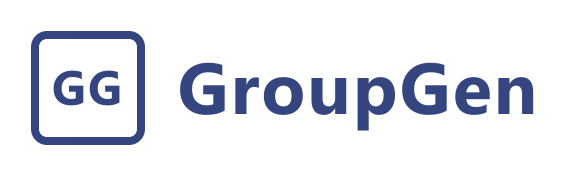
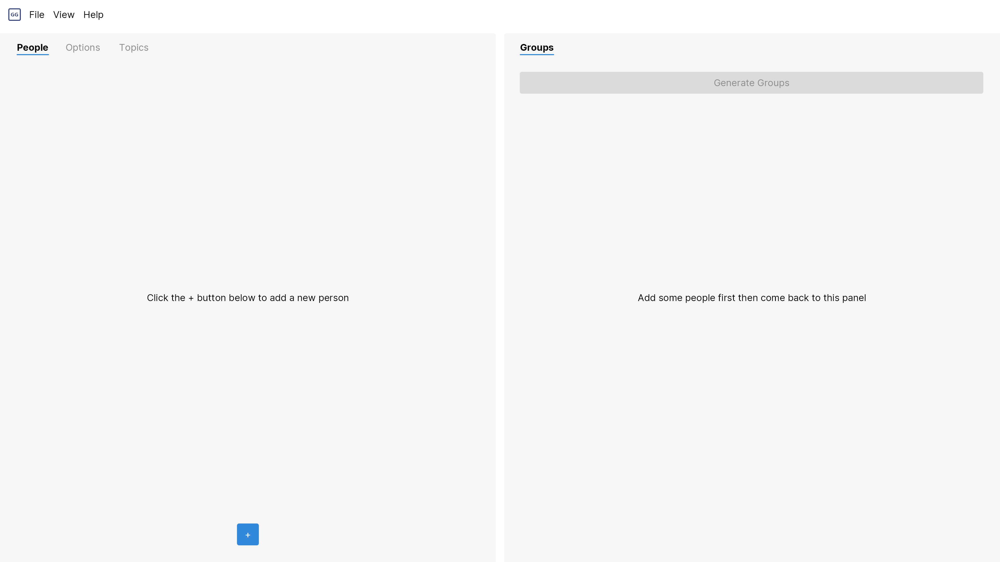

  <h1>Group Gen</h1>
  

    
    
  

  
  
A feature packed, offline, privacy respecting, free and open source random group generator

# Mockup

# Plans for Implementation

The following is some ideas in dot points. Further details and documentation will come soon.

- Qt 6 and QML
- C++
- An architecture based off of [Flux](https://facebook.github.io/flux/)

# License

Group Gen is released under the GNU General Public License v3.
